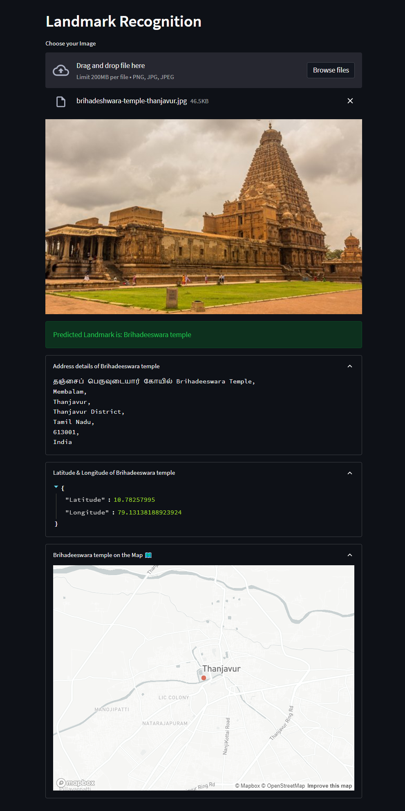
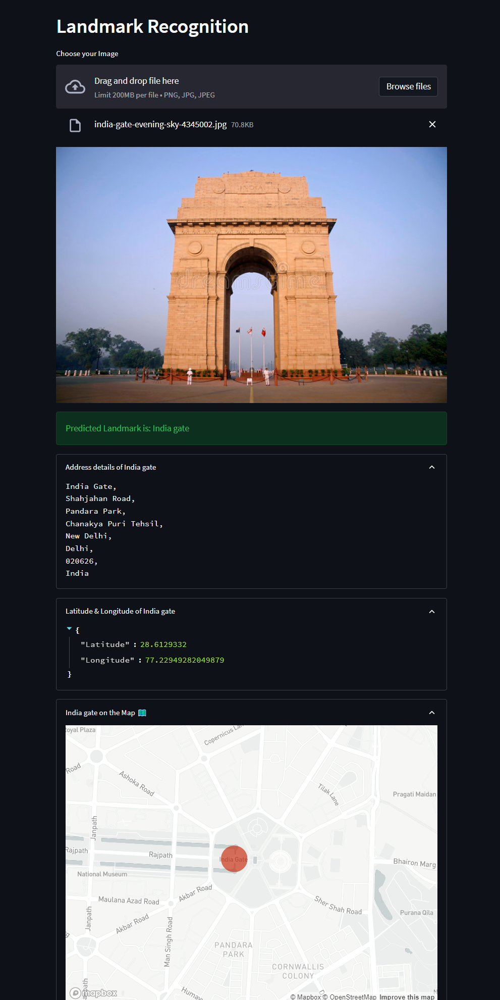

# Landmark Recognition App


Landmark Recognition App is used to predict landmark from user given image. it provides information about lankmark's full address, latitude & longitude and plot the predicted landmark on the map. The trained model [`landmarks_classifier_asia_V1/1`](https://tfhub.dev/google/on_device_vision/classifier/landmarks_classifier_asia_V1/1) is taken from the Tensorflow-Hub. There are total `98961` classes supported, in which Asia's most of the famous Landmark is covered.

## Installation
Open command prompt and create new environment
```
conda create -n your_env_name python = (any_version_number)
```
Then Activate the newly created environment
```
conda activate your_env_name
```
Clone the repository using `git`
```
git clone https://github.com/Prakashdeveloper03/Landmark-Recognition.git
```
Change to the cloned directory
```
cd <directory_name>
```
Then install all requirement packages for the app
```
pip install -r requirements.txt
```
Then, Run the `translator.py` script
```
streamlit run app.py
```
## 📷 Screenshots
### Brihadeeswara Temple


### India Gate
